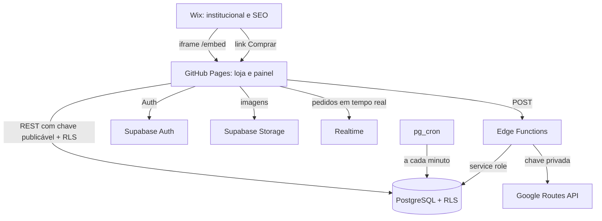

# Arquitetura

Ecossistema comercial de uma marca artesanal de cookies em Cachoeiro de Itapemirim (ES): site institucional, cardápio incorporável, loja online, checkout, pedidos, estoque, frete por rota real e painel administrativo.

## Visão geral

```
                 Cliente (celular ou computador)
                              │
          ┌───────────────────┴───────────────────┐
          ▼                                       ▼
┌──────────────────────┐              ┌──────────────────────────┐
│ WIX                  │   iframe     │ GITHUB PAGES             │
│ www.suamarca.com.br  │ ───────────▶ │ loja.suamarca.com.br     │
│                      │  /embed      │ (HTML/JS/CSS estáticos)  │
│ institucional, SEO,  │              │                          │
│ história, FAQ,       │  link        │ /            loja        │
│ políticas, contato   │ ───────────▶ │ /embed       cardápio    │
└──────────────────────┘ "Comprar"    │ /checkout    compra      │
                                      │ /pedido/:tk  status      │
                                      │ /admin       painel      │
                                      └────────────┬─────────────┘
                                                   │ HTTPS (chave publicável)
                                                   ▼
┌──────────────────────────────────────────────────────────────────────┐
│ SUPABASE (fonte única da verdade)                                     │
│                                                                       │
│  PostgREST ──▶ PostgreSQL + RLS                                       │
│                 • catálogo, clientes, pedidos, estoque, reservas      │
│                 • funções atômicas: create_order, transições,         │
│                   estoque, expiração (pg_cron), frete, horários       │
│                                                                       │
│  Auth ───────▶ contas individuais da equipe (OWNER, ADMIN, OPERATOR)  │
│  Storage ────▶ fotos dos produtos (bucket público, escrita ADMIN+)    │
│  Realtime ───▶ novos pedidos no painel (com polling de reserva)       │
│  Edge Functions (Deno, sem dependências externas)                     │
│    • delivery-quote ──▶ RoutingProvider ──▶ Google Routes API         │
│    • create-order   ──▶ valida, revalida rota, chama create_order     │
│    • admin-users    ──▶ gestão da equipe (somente OWNER)              │
└──────────────────────────────────────────────────────────────────────┘
```



## Princípios

1. **Supabase é a única fonte da verdade.** Wix e GitHub não guardam produtos, preços ou estoque. Alterar um preço no painel muda o banco; loja e cardápio do Wix leem o mesmo banco. Nenhum deploy é necessário.
2. **O navegador nunca define valores.** O checkout envia apenas IDs de produtos, quantidades, dados do cliente, endereço, horário e forma de pagamento. Preço, subtotal, frete, total e estoque são calculados no banco. Campos extras (`priceCents`, `totalCents`, `distanceKm`, `lat`...) são rejeitados.
3. **Operações sensíveis são atômicas no banco.** `public._create_order` trava as linhas dos produtos em ordem estável (`FOR UPDATE`, sem deadlock), confere estoque, grava pedido, itens com snapshot, reservas e movimentos na mesma transação. Estoque negativo é impossível (CHECK + função única de movimentação).
4. **Segurança no backend, não no frontend.** O painel é público como código; o que protege os dados é RLS + funções `SECURITY DEFINER` que conferem o papel de quem chama.
5. **Falhar de forma honesta.** Se a API de mapas falhar, o sistema não inventa distância: mostra "Não foi possível calcular a entrega automaticamente." e oferece WhatsApp. O painel tem frete manual.

## Camadas

### Wix (institucional)
Homepage, história, produtores, FAQ, políticas, contato e SEO principal. A página `/cardapio` incorpora `https://loja.../embed`. Detalhes em [docs/WIX.md](docs/WIX.md).

### Frontend (GitHub Pages)
React 19 + Vite + TypeScript + React Router + Tailwind CSS 4 + Lucide.

- Build estático. Rotas conhecidas recebem `index.html` próprio (respondem 200) e as dinâmicas usam `404.html`, que é o mesmo app (`scripts/postbuild.mjs`).
- A loja pública usa um cliente REST mínimo (`src/lib/rest.ts`); o `supabase-js` só é baixado no painel.
- Checkout, página de pedido, `/embed` e painel são carregados sob demanda.
- CSP via `<meta>` gerada no build (somente o Supabase configurado, ViaCEP e analytics opcionais).
- O painel se recusa a abrir dentro de iframe (proteção contra clickjacking, já que o Pages não permite `frame-ancestors`).

### Supabase (backend)

| Peça | Responsabilidade |
|---|---|
| `supabase/migrations/*_core_schema.sql` | Tabelas, tipos, constraints (centavos, estoque ≥ 0, total consistente) |
| `*_helpers_and_triggers.sql` | Papéis, erros padronizados, auditoria, bloqueio de alteração direta de estoque |
| `*_business_rules.sql` | Frete, horários, criação de pedido, transições, pagamento, estoque, dashboard, LGPD |
| `*_security_rls.sql` | RLS em todas as tabelas, GRANTs mínimos, privilégios padrão fechados |
| `*_storage_realtime_cron.sql` | Bucket de imagens, publicação Realtime, jobs do pg_cron |
| `supabase/functions/*` | Edge Functions (Deno) sem dependências externas |

## Modelo de dados

| Entidade | Observações |
|---|---|
| `profiles` + enum `app_role` | Equipe. O papel (OWNER, ADMIN, OPERATOR) é um enum; não há tabela `roles` separada porque cada pessoa tem exatamente um papel |
| `categories`, `products`, `product_images` | Catálogo. Imagens no Storage, banco guarda o caminho |
| `customers`, `customer_addresses` | Clientes sem login, identificados pelo telefone E.164 |
| `orders`, `order_items`, `order_status_history` | Pedido com `code` curto aleatório (humano) e `public_token` de 192 bits (acesso). Itens com `product_name_snapshot` e `unit_price_cents_snapshot` |
| `inventory_movements`, `inventory_reservations` | Livro-razão de estoque (IN, OUT, RESERVATION, RELEASE, ADJUSTMENT) e reservas com expiração |
| `delivery_rules`, `delivery_quotes` | Faixas de preço (sem sobreposição, via exclusion constraint) e cache/auditoria das rotas (sem endereço completo) |
| `store_settings` | Linha única; campos privados (origem da rota, endereço de retirada) só para a equipe |
| `payment_records` | Livro-razão de pagamentos; `orders.payment_status` guarda o estado atual |
| `audit_logs` | Quem fez o quê e quando |
| `rate_limits` | Limite de tentativas por hash de IP e teto global de chamadas à API de mapas |

Valores monetários sempre em centavos (`integer`). Datas em `timestamptz`; toda regra de horário usa `America/Sao_Paulo` no servidor.

## Fluxos principais

### Pedido

```
navegador                    create-order (Edge)                 banco
   │  itens + dados + endereço     │                                 │
   ├──────────────────────────────▶│ valida (rejeita campos extras)  │
   │                               │ rate limit por hash de IP       │
   │                               │ entrega? normaliza endereço ────▶ hash de destino
   │                               │   cache de rota? ◀──────────────┤
   │                               │   senão Google Routes (sem trânsito)
   │                               │ create_order(payload, quoteId) ─▶ trava produtos
   │                               │                                 │ confere estoque e preços
   │                               │                                 │ valida janela (SP)
   │                               │                                 │ recalcula frete pelas regras
   │                               │                                 │ compara total esperado
   │                               │                                 │ grava pedido + reservas
   │◀──────────────── 201 {code, publicToken, total}  ◀──────────────┤
```

- **Idempotência:** `idempotencyKey` gerada por intenção de compra. Advisory lock + índice único. Mesma chave e mesmo conteúdo devolvem o mesmo pedido (`replayed: true`); conteúdo diferente devolve `IDEMPOTENCY_CONFLICT`.
- **Preço mudou:** se o total calculado difere do que o cliente viu, nada é gravado e o cliente confirma o novo total (`PRICE_CHANGED`).

### Status (separados)

```
Pedido:     NEW ──▶ CONFIRMED ──▶ PREPARING ──▶ READY ──▶ COMPLETED            (retirada)
             │  └─▶ AWAITING_PAYMENT ─┘                  └─▶ OUT_FOR_DELIVERY ──▶ COMPLETED (entrega)
             └─▶ CANCELED (com motivo)     NEW/AWAITING_PAYMENT ──(prazo)──▶ EXPIRED (sistema)
Pagamento:  PENDING ──▶ MANUAL_CONFIRMATION ──▶ PAID ──▶ REFUNDED
                   └──────────▶ FAILED ◀──────┘
```

A fonte única das transições é `public.order_next_statuses` / `payment_next_statuses`. O painel mostra apenas os botões permitidos, e o banco rejeita qualquer outra (`INVALID_TRANSITION`). Cada mudança vai para `order_status_history` e `audit_logs`.

### Estoque

| Evento | Disponível | Reservado | Movimento |
|---|---|---|---|
| Pedido criado | − q | + q | RESERVATION |
| Pedido confirmado | = | − q | OUT (consumo) |
| Cancelado antes de confirmar / expirado | + q | − q | RELEASE |
| Cancelado depois de confirmar (com devolução) | + q | = | IN |
| Entrada / saída / ajuste manual | ± | = | IN / OUT / ADJUSTMENT (motivo obrigatório) |

PIX nasce `AWAITING_PAYMENT` com prazo de pagamento (padrão 60 min); dinheiro e cartão nascem `NEW` com prazo para a loja confirmar (padrão 12 h). O `pg_cron` expira pedidos vencidos a cada minuto e a criação de pedidos também libera, antes de reservar, reservas vencidas dos mesmos produtos.

### Frete

```
endereço de produção (privado) ─┐
endereço do cliente ────────────┼─▶ RoutingProvider (GoogleRoutesProvider) ─▶ distanceMeters
                                │      TRAFFIC_UNAWARE, FieldMask mínima,
                                │      detecção de endereço impreciso
                                ▼
                     compute_delivery_fee (banco) ─▶ faixa (min, max] ou base + km,
                                                      frete grátis acima de X,
                                                      distância máxima
```

- Cotação só quando o endereço está completo, com debounce e cache no navegador; cache no servidor por hash (origem + destino normalizado) por 7 dias.
- Teto global de chamadas por hora (`ROUTING_MAX_CALLS_PER_HOUR`) protege o orçamento.
- Duração é só estimativa exibida; nunca altera o preço.
- Outros provedores (Mapbox, OpenRouteService) entram implementando `RoutingProvider` em `supabase/functions/_shared/routing/` e registrando em `createRoutingProvider`.

### Pagamentos

`PaymentProvider` (`supabase/functions/_shared/payments.ts`) com o provedor `MANUAL` (PIX com chave, dinheiro, cartão na entrega/retirada). Um gateway futuro implementa a interface e confirma pagamentos por webhook assinado com service role, gravando em `payment_records` (índice único por `provider + external_id + status` evita duplicidade). O navegador nunca marca um pedido como pago.

### Tempo real

O painel assina `postgres_changes` em `orders` e `products` (RLS vale para o Realtime). Se o WebSocket não conectar em 10 s ou cair, o painel passa a fazer polling a cada 15 s e continua avisando novos pedidos.

## Decisões e alternativas

| Decisão | Motivo |
|---|---|
| Regras de negócio em funções SQL | Atomicidade real (transação + locks) e uma só implementação para loja, painel e Edge Functions |
| Edge Functions sem dependências | Boot rápido, nada para baixar no deploy, código testável com Vitest no Node |
| Carrinho só com IDs e quantidades | Preço e estoque sempre vêm do banco; carrinho se corrige sozinho |
| `/embed` abre a loja em nova aba para comprar | Evita problemas de cookies de terceiros, sandbox e checkout dentro de iframe |
| Admin no mesmo repositório | Um único build; o painel é carregado sob demanda e protegido pelo backend |
